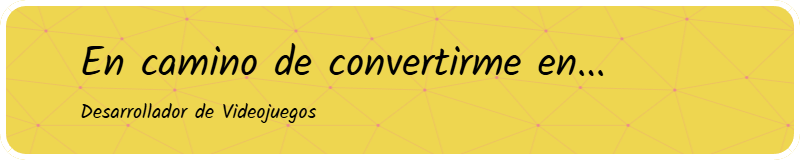
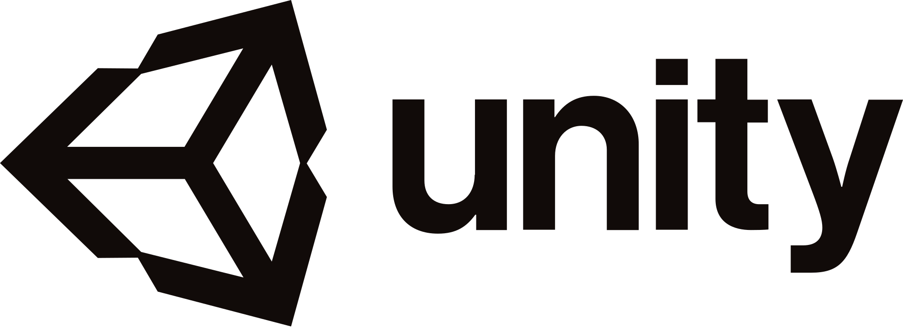

#  Bienvenid@ al GitHub de NilsGiN

Me dedico a desarrollar videojuegos porque, claro, ¿por qué no elegir una carrera que requiere saber de arte, programación y lidiar con errores 24/7? Sigo aprendiendo porque rendirse sería demasiado fácil, y aunque a veces parece que nunca lo lograré, aquí estoy, intentando que siempre funcione.

## Tecnologías

  
  
  
  
  
  
  

<!--
**NilsGiN/NilsGiN** is a ✨ _special_ ✨ repository because its `README.md` (this file) appears on your GitHub profile.

Here are some ideas to get you started:

- 🔭 I’m currently working on ...
- 🌱 I’m currently learning ...
- 👯 I’m looking to collaborate on ...
- 🤔 I’m looking for help with ...
- 💬 Ask me about ...
- 📫 How to reach me: ...
- 😄 Pronouns: ...
- ⚡ Fun fact: ...
-->
